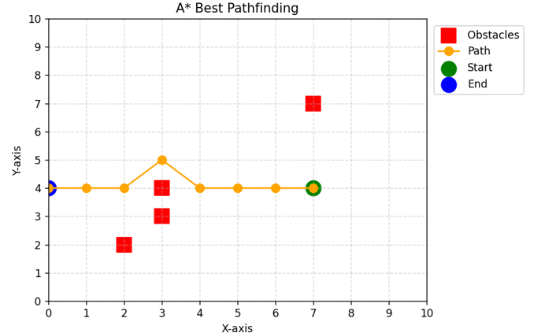

# A* Best Pathfinding (Python)

This repository contains a **Python script** that generates a **random start point** and a **random end point**, places **random obstacles** on a grid (workspace), and calculates a **path** that avoids obstacles over a `10 x 10` grid. Visualization is done using **Matplotlib**.

> Example preview:
>
> 

## 🧠 What is A*?
**A\*** (pronounced *"A star"*) is a widely used algorithm in computer science for **pathfinding** and **graph traversal**. It is used to find the **shortest path** between a start node and a goal node.  
In this script, the **neighbor node with the smallest Euclidean heuristic** towards the goal is prioritized, and the resulting path is reconstructed while avoiding obstacles.

> Key idea of this project: *A mesh of 10 x 10 nodes is set as a workspace. The heuristic calculation is done via Euclidean distance (distance between two nodes). The coordinates of the neighboring node that has the smallest distance to the end node are selected. If the neighbor node is in an obstacle or has already been analyzed, it is skipped, and the calculation continues with the remaining nodes.*

## ✨ Features
- **10x10 grid** as the workspace (configurable).
- **Random start** and **end points** (avoiding obstacles) and configurable **obstacles**.
- **8-directional movement** (including diagonals).
- **Euclidean heuristic** `h(n)` to estimate distance to the goal.
- **Visualization** of path, start/end points, obstacles, grid, and legend.
- Console messages: *"Path found"* or *"No path found"*. 

> Note: The node selection loop uses the **heuristic** to prioritize the next node to expand. This works like a *greedy best-first search* based on `h(n)`.

## 📦 Requirements
- Python 3.8+
- Packages: `numpy`, `matplotlib`

Install dependencies:
```bash
pip install -r requirements.txt
```

## ▶️ Usage
Clone/download the repository, install dependencies, and run:
```bash
python astar_pathfinding.py
```

The script will:
1. Generate **random start and end points** (different and not in obstacles).
2. Run the search and **reconstruct the path** (`reconstruct_path`).
3. **Plot** the path and the environment.

> For reproducibility (same random points), add above the `random.randint(...)` calls:
```python
random.seed(42)  # any integer
```

## ⚙️ Quick customization
- **Grid size**: change `width` and `height` (default 10x10).
- **Obstacles**: edit the list `obstacles = [(2, 2), (3, 4), ...]`.
- **Movement**: currently allows 8 neighbors (including diagonals) in `get_neighbors`.

## 🧩 Project structure
```
a_star_pathfinding/
├── astar_pathfinding.py     # Main script (search + visualization)
├── requirements.txt         # Dependencies
├── .gitignore               # Files ignored by git
└── images/
    └── screenshot.png       # Example image used in README
```

## 🛣️ How it works (summary)
- **Heuristic (Euclidean)**: `h(a,b) = sqrt((bx-ax)^2 + (by-ay)^2)`.
- **Neighbors**: generated with `get_neighbors(...)` respecting bounds and diagonals.
- **Closed set**: `closed_set` prevents revisiting nodes.
- **Reconstruction**: `came_from` stores each node’s parent to build the final path.

## 🚧 Current limitations
- If no valid path exists, you will see **"No path found"**.
- Node selection uses **only** the heuristic `h(n)`; if you want the **classic A\***, use `f(n) = g(n) + h(n)` with accumulated cost `g(n)`.

## 🗺️ Future improvements
- Implement full **A\*** (`f = g + h`) with costs for moves (cardinal/diagonal).
- Add **cell costs** (different terrain costs).
- Allow parameters from **CLI** (`--width`, `--height`, `--seed`, `--num-obstacles`, etc.).
- **Random obstacle generation** with configurable density.
- **Step-by-step animation** of node expansion.
- **Interactive mouse selection** of start/end/obstacles.
- Save the **path** and **figure** to files (PNG/JSON).

---